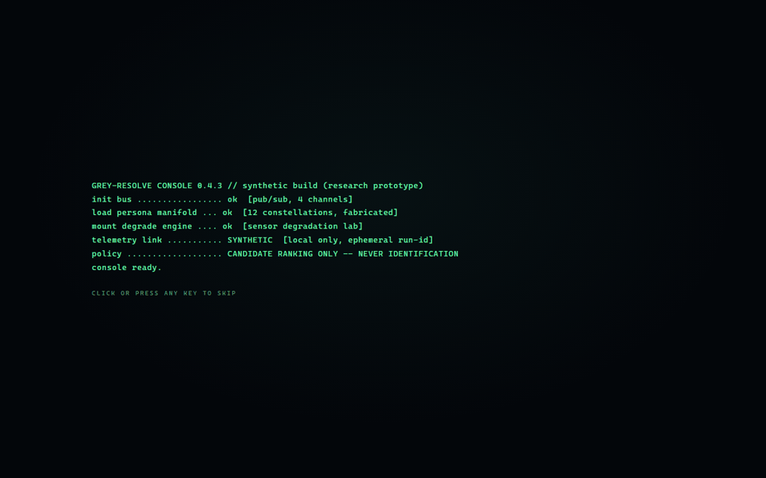
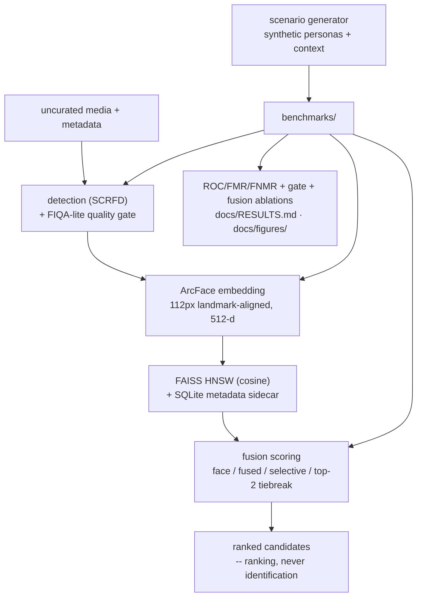

# Grey-Resolve — degraded-media entity resolution

**Live demo: https://pcschmidt.github.io/Grey-Resolve/** (the Resolution Console —
a static "forbidden cockpit" UI on GitHub Pages; fabricated demo data, real metric
telemetry). Also runnable locally from `docs/` — see [`docs/PAGES.md`](docs/PAGES.md).

<div align="center">



**[▶ Open the Resolution Console](https://pcschmidt.github.io/Grey-Resolve/)**

</div>

## What is this? (plain-language overview)

Grey-Resolve answers one question: *when face evidence degrades and several identities
look genuinely alike, can contextual metadata resolve the ambiguity — and how do you
know when it cannot?* It is an entity-resolution pipeline over degraded, uncurated
media: detect a face, quality-gate it, embed it, retrieve near-duplicates, and try to
break the resulting near-ties with lightweight context (time, coarse geo, source,
text entities). It was built from an adapted vector-search coursework project
(IronClad, JHU 705.603) and re-scoped around the evaluation practices that
mission-critical ML actually demands.

> Detect → quality-gate → embed → retrieve → fuse context → **resolve, or honestly
> decline to resolve.**

The name is a double play: **grey-zone** media (low-resolution, off-angle, uncurated
open sources) and entity **resolution**. The defense-intelligence framing is the
motivation; the deliverable is the engineering — and the honesty.

The thing that makes it more than a face-matching demo:

- **Operational benchmarking, not accuracy percentages.** EER, FMR/FNMR and ROC
  curves per degradation type (blur, downsampling, brightness, rotation), produced
  from one command, with detection failures counted per condition rather than hidden.
  The headline finding is structural: **ranking quality ≠ operating-point
  calibration** — EER stays near zero while FMR@FNMR=1% explodes to 0.873 under
  severe downsampling. Thresholds must be calibrated per condition.
- **A quality gate that measurably helps.** FIQA-gated scoring lowers FNMR at a fixed
  operating threshold in nearly every condition and never materially worsens it —
  and where quality is genuinely bad the gate rejects almost everything instead of
  letting bad matches through.
- **Honest negative science on the fusion claim.** The project's central hypothesis —
  context resolves face near-ties — was tested at scale and is **not supported** on
  this data with the tested context model. A small-n positive result (n=4) did not
  replicate at scale (n=18, reversed sign); the failure mechanism was diagnosed
  (extreme-value noise from many competing context scores) and a guarded top-2
  tiebreak design was shown to be provably safe but neutral. Findings 6–9 in
  [`docs/RESULTS.md`](docs/RESULTS.md) document the full arc. This is the evaluation
  honesty that matters in mission-critical ML — and every step is reproducible from
  committed scripts.
- **Defense framing without surveillance tooling.** Synthetic and public research
  data only; no face imagery in the repo or the UI; candidate *ranking* semantics
  everywhere ("ranking is not authorization"); an explicit non-operational banner.

You can drive it three ways:

1. **The published console** — boot sequence, streaming synthetic contacts with
   trust badges, a 3D embedding manifold with tie-break resolution sequences, live
   degradation modes driven by the project's own operators, and a telemetry ticker
   sourced from real run artifacts.
2. **The evaluation suites** — `.venv/Scripts/python -m pytest -q` (241 tests),
   `python benchmarks/evaluate_roc.py` (degraded-input ROC/FMR/FNMR sweeps),
   `python benchmarks/evaluate_fusion.py` (face-only vs fused vs selective vs
   tiebreak, context-noise sweeps, face-gap slices), `python benchmarks/make_figures.py`
   (regenerate every figure), `python benchmarks/latency_profiler.py`.
3. **The service + stack** — FastAPI (`/ingest`, `/search`, `/health`) over the real
   pipeline, or `docker compose up` in `docker/` (API + Qdrant; model weights are
   deliberately never baked into images).

| | |
| --- | --- |
| Live demo | https://pcschmidt.github.io/Grey-Resolve/ — Resolution Console, static, GitHub Pages from `docs/` |
| Pipeline | SCRFD detection → FIQA-lite gate → InsightFace ArcFace (w600k_r50, 512-d) → FAISS HNSW + SQLite metadata sidecar |
| Benchmarks | Degraded-input ROC/FMR/FNMR/EER sweeps + quality-gate ablation + fusion ablation (face / fused / selective / tiebreak) |
| Latency | HNSW search p95 ≤ 1.6 ms at 50k vectors vs ~29 ms exact brute force (CPU) |
| Tests | 241 green (pytest), deterministic, no weights needed for the suite |
| Deployment | FastAPI service; Docker Compose (API + Qdrant, weights at runtime via volume); tested FAISS→Qdrant migration path |
| Licence | MIT (code) · model weights non-commercial and never redistributed (see `THIRD_PARTY_NOTICES.md`) |
| Definitive result | Quality gate: FNMR 0.028 → 0.020 at threshold 0.5 on clean probes. Fusion claim: **not supported** (tiebreak Δ +0.000 / −0.056 on n=18) |
| Honest scope | Research prototype on LFW-derived research data + synthetic scenarios; nothing here transfers to real-world operational accuracy claims |

## Architecture at a glance



## What the evaluation shows

Full findings with numbers, caveats, and run ids: [`docs/RESULTS.md`](docs/RESULTS.md);
figures: [`docs/figures/`](docs/figures/); sanitized aggregate metrics:
[`docs/results/`](docs/results/).

| Finding | Result |
| --- | --- |
| Degraded-input sweep (138 images / 100 identities) | EER ≈ 0 until severe degradation; blur σ=8 → EER 0.078; downsample ×0.1 → EER 0.046 but FMR@FNMR=1% = 0.873 |
| Detection failure | A first-class, per-condition counted outcome (42/138 probes at brightness Δ=0.75) — never a crash, never hidden |
| Quality gate ablation | Gated FNMR ≤ full FNMR in nearly every condition (blur σ=3: 0.127 → 0.000); collapses to zero pass-rate exactly where quality is bad |
| Fusion ablation | Raw fusion harms ties (0.500 → 0.167 hit@1 at gap ≤ 0.05); selective gating reduces but does not remove the damage; top-2 tiebreak is safe (±0.02) but neutral |
| Latency | HNSW p95 ≤ 1.6 ms at 50k vectors vs ~29 ms brute force (CPU, 512-d) |

## Repository structure

```text
grey-resolve/
├── src/grey_resolve/          # pipeline: detection, embeddings, index, fusion, api, plotting
├── benchmarks/                # evaluate_roc · evaluate_fusion · latency_profiler · make_figures
├── configs/                   # HNSW hyperparameters · operating profiles · scenario config
├── docker/                    # Dockerfile · docker-compose.yaml · serve entrypoint (weights never baked in)
├── docs/                      # RESULTS.md · figures/ · results/ · PAGES.md · the demo UI (index.html + demo/)
├── scripts/                   # fetch_backbone.py (runtime weights) · demo/diagnostic tooling
└── tests/                     # 241 tests, deterministic
```

## Getting started

```bash
uv venv .venv                             # Python 3.12
uv pip install -e ".[dev]"                # core deps + pytest/ruff
uv pip install -e ".[index,backbone,api]" # faiss, insightface/onnxruntime, fastapi
python scripts/fetch_backbone.py          # downloads non-commercial weights at runtime
.venv/Scripts/python -m pytest -q         # run the test suite
```

Weights are downloaded at runtime and never committed (`THIRD_PARTY_NOTICES.md`).
Datasets with non-commercial research terms (LFW, CASIA-WebFace, VGGFace2) are
**never** included; loaders expect user-supplied local data, and the Phase 2 scenario
data is entirely synthetic.

## Glossary

Acronyms used above, defined once:

| Acronym | Stands for | What it means here |
| --- | --- | --- |
| ROC | Receiver Operating Characteristic | Curve of true- vs false-match behaviour as the decision threshold moves; the project's main evaluation plot |
| EER | Equal Error Rate | The error rate at the threshold where false matches and false non-matches are equal; single-number summary of a ROC curve |
| FMR | False Match Rate | Fraction of impostor (different-identity) comparisons scored as matches at a given threshold |
| FNMR | False Non-Match Rate | Fraction of genuine (same-identity) comparisons scored as non-matches at a given threshold |
| FMR@FNMR=1% | — | The false-match rate once the threshold is set so that only 1% of genuine comparisons are missed; the strict operating point used throughout |
| FIQA | Face Image Quality Assessment | Scoring how usable a face image is before trusting its match; here a lightweight heuristic (sharpness, exposure, size) behind a swappable interface |
| SCRFD | — (model name from the InsightFace paper) | The face detector bundled with InsightFace; finds face bounding boxes and 5-point landmarks used for alignment |
| ArcFace | — (model/training-method name) | The face-embedding model family used here (InsightFace `w600k_r50`): turns an aligned face crop into a 512-d vector |
| FAISS | Facebook AI Similarity Search | The library that stores and searches the face vectors |
| HNSW | Hierarchical Navigable Small World | The approximate-nearest-neighbour graph index used in FAISS; fast search with tunable accuracy (recall 0.99 vs exact in our tests) |
| SQLite | Structured Query Language Lite | The embedded database holding per-vector metadata (time, geo, source, text entities) beside the FAISS index |
| API | Application Programming Interface | The REST service (`/ingest`, `/search`, `/health`) over the pipeline |
| FastAPI | — (framework name) | The Python web framework serving the API |
| OSINT | Open-Source Intelligence | The grey-zone data context (public media streams) motivating the project; no real OSINT collection is performed |
| LFW | Labeled Faces in the Wild | The public research face dataset the local course gallery derives from; research-only, never redistributed here |
| CASIA-WebFace | CASIA (Chinese Academy of Sciences, Institute of Automation) WebFace | Another research face dataset with non-commercial terms — named only in licence discussions |
| VGGFace2 | Visual Geometry Group Face 2 (Oxford VGG group) | Same: named only in licence discussions, never shipped |
| MIT | Massachusetts Institute of Technology | The licence this code is released under |
| CPU | Central Processing Unit | All latency numbers are CPU-only (no GPU) |
| UI | User Interface | The Resolution Console demo |
| 3D | three-dimensional | The embedding-manifold view in the demo |

Terms used above that are not acronyms: **near-tie** — two identities whose face
scores are almost equal (the ambiguity regime, defined by the measured top-1/top-2
face-score *gap*); **ablation** — the same experiment run with one component
switched off (e.g. face-only vs fused) to measure that component's contribution;
**probe / gallery** — the query images being verified against the enrolled reference
set; **operating threshold** — the score cutoff at which a comparison becomes a
"match"; **synthetic scenario** — a fabricated dataset of personas and metadata
(never real people) used to stress-test the fusion logic.

## Ethics & limitations

- **Synthetic and public data only.** No real persons, real incidents, or operational
  intelligence data in code, tests, benchmarks, or the UI. The demo console uses
  procedural abstract tiles — deliberately no face imagery, even synthetic.
- **Ranking, not identification.** The system returns scored similarity candidates.
  Interpreting candidates as identity claims is out of scope and unsupported.
- **Known failure modes.** Face recognition degrades sharply on demographic
  subgroups, heavy occlusion, and extreme pose; quality gating reduces but does not
  remove this. Synthetic-set and LFW-derived results do not transfer to real-world
  accuracy claims.
- **No surveillance tooling.** No watchlist ingestion, no real OSINT scraping, no
  gait/body re-identification.

## Licence

Code: [MIT](LICENSE). Pretrained model weights (InsightFace buffalo_l) have their own
**non-commercial** terms and are not redistributed — see
[`THIRD_PARTY_NOTICES.md`](THIRD_PARTY_NOTICES.md) and
[`docs/BACKBONE_LICENSES.md`](docs/BACKBONE_LICENSES.md).

## Acknowledgment

Adapted from coursework completed for JHU 705.603 Creating AI-Enabled Systems
(IronClad vector-search assignment). Course code informed the design; this repository
is an independent, re-scoped implementation.
